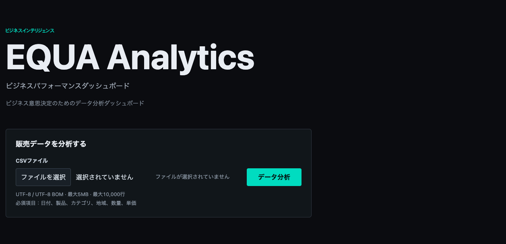
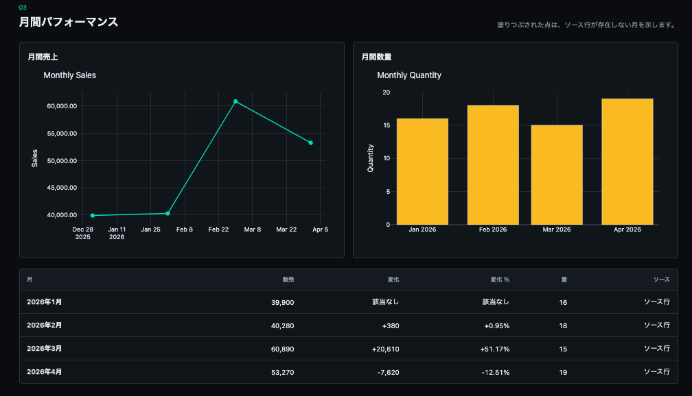
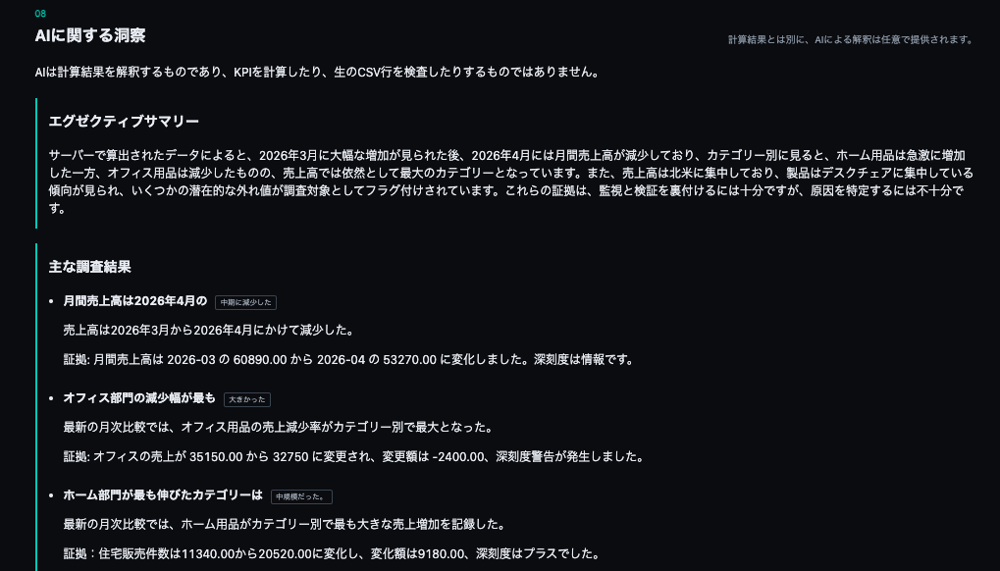
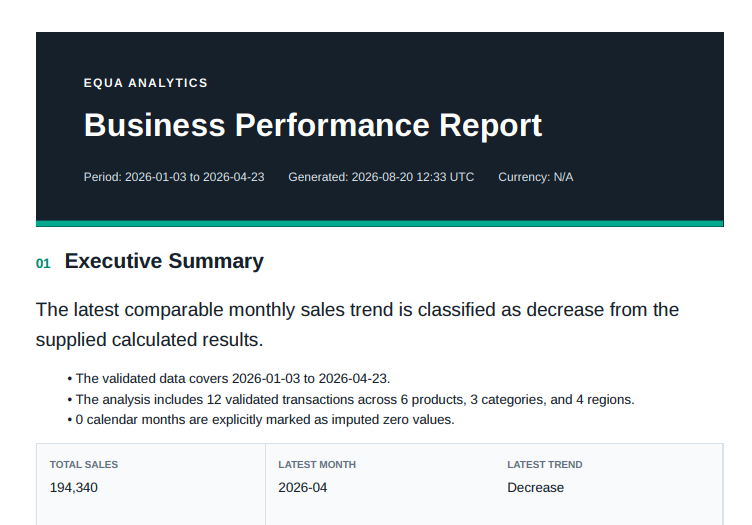

# EQUA Analytics

販売CSVをアップロードすると、入力検証、売上集計、時系列・商品・カテゴリ・地域別分析、データ品質評価を行い、ダッシュボードとBusiness Reportを生成するWebアプリケーションです。

数値計算と異常候補の検出は決定論的なロジックで行い、AIは計算済み結果の解釈と確認事項の提案に限定しています。ポートフォリオ兼MVPとして、分析の正確性だけでなく、入力検証、プライバシー、障害時のfallback、PDF生成を含む一連の業務フローを実装しています。

**Production:** [https://equa-analytics.onrender.com](https://equa-analytics.onrender.com)

## 提供する価値

- 売上CSVを、確認しやすいKPI・グラフ・ランキングへ変換
- 月次推移、商品・カテゴリ・地域ごとの実績を同じ画面で比較
- 欠損月、重複行、入力不備、潜在的な外れ値を分析結果と分けて提示
- 計算済みの根拠に基づくAI解釈を、必要な場合だけ追加
- HTMLまたはPDFのBusiness Performance Reportとして共有・保存
- AIが利用できない場合も、決定論的な分析とReport出力を継続

## 画面と成果物

### 1. Dashboard

CSVをアップロードすると、検証済みデータからKPI、データ品質、時系列、商品、カテゴリ、地域、検出インサイトを同一のダッシュボードに表示します。



### 2. Monthly Performance Analysis

月次売上と数量をグラフとテーブルで確認できます。前月差・変化率を併記し、元データに存在しない月は補完値として明示します。



### 3. AI Insights

AIは生のCSVを直接分析せず、サーバーで計算した上限付きコンテキストだけを解釈します。Executive Summary、主要な調査結果、根拠、推奨する確認作業を提示します。KPIの計算や異常検出そのものはAIに依存しません。



### 4. Business Performance Report

Dashboardの統合パネルから、HTML / PDFとAI Analysisの有無を選択してReportを生成できます。ReportにはKPI、月次・ディメンション分析、データ品質、5つの静的SVGチャートが含まれます。



## 主な機能

### Deterministic Analytics

- Total Sales、Total Quantity、Transactions
- Average Order Value、Average Unit Price
- 商品・カテゴリ・地域のユニーク数
- 月次売上・数量・取引件数・前月差・変化率
- 商品・カテゴリ・地域別の売上ランキングと構成比
- 直近の比較可能月におけるカテゴリ増加・減少
- 売上変化、集中度、ゼロ活動、データ不足のdeterministic insights
- IQRルールによる潜在的な外れ値候補の検出

金額計算には`Decimal`を使用します。欠損している暦月はimputed zeroとして明示し、ランキングは同順位でも結果が安定する決定論的なルールで並べます。原価を入力項目に含まないため、利益や粗利は算出しません。

### AI Insights

AIへ渡すのは、計算済みのメタデータ、KPI、直近6か月、上位5件のディメンション、件数を制限したdeterministic insightsです。コンテキストは最大12,000文字です。

- `AI_MODE=disabled`: AIなしでDashboardとReportを利用
- `AI_MODE=fake`: 外部通信を行わない開発・テスト用の決定論的出力
- `AI_MODE=openai`: OpenAI Responses APIとStructured Outputsを利用

OpenAI requestは`store=False`、timeout、制限付きretry、最大1,800 output tokensで実行します。AIにはKPIの再計算、原因の断定、裏付けのない価格・人員・在庫・マーケティング判断を行わせず、調査・検証・モニタリングの提案に限定しています。provider failureやrate limit時も、計算済みDashboardは失われません。

### Business Report

以下の4パターンを、1つのReportパネルから出力できます。

| Format | AI Analysis | Endpoint |
|---|---:|---|
| HTML | OFF | `POST /reports/html` |
| PDF | OFF | `POST /reports/pdf` |
| HTML | ON | `POST /reports/html/ai` |
| PDF | ON | `POST /reports/pdf/ai` |

HTML ReportはCSSと5つのSVGチャートを内包したself-contained形式です。PDFは同じReportモデルからWeasyPrintで生成します。生成物は永続保存せず、HTMLは2 MB、PDFは5 MBの出力上限を設けています。

## CSV仕様

| 種別 | カラム |
|---|---|
| 必須 | `date`, `product`, `category`, `region`, `quantity`, `unit_price` |
| 任意 | `discount`, `customer_type` |

- 売上式: `quantity × unit_price × (1 - discount)`
- 文字コード: UTF-8 / UTF-8 BOM
- 上限: 5 MB、10,000データ行
- 日付: `YYYY-MM-DD`
- 数量: 0以上の整数
- 単価: 0以上、最大1,000,000,000
- 割引率: 0〜1、空欄は0
- テキスト: 最大200文字

NUL byte、未知または重複した正規化header、不正な列数、指数表記、NaN、Infinityなどを拒否します。重複データ行は品質情報として件数を示しますが、勝手に除外せず計算に保持します。

## Architecture

```text
CSV upload
  -> bounded in-memory read
  -> syntax / header / value validation
  -> normalization
  -> pandas aggregation + Decimal calculations
  -> deterministic analysis and insights
  -> Dashboard
       ├─ optional bounded AI interpretation
       └─ self-contained HTML / WeasyPrint PDF Report
```

Dashboard、AI、Reportの各routeはCSVをサーバー側で再検証・再計算します。クライアントが送る分析snapshotを信頼せず、データベースや一時ファイルにも依存しません。

## 主要技術

| 分類 | 技術 |
|---|---|
| Backend | Python 3.12, FastAPI, Uvicorn |
| Validation / Models | Pydantic, Pydantic Settings |
| Analysis | pandas, Python `Decimal` |
| Dashboard | Jinja2, Plotly, vanilla JavaScript, CSS |
| AI | OpenAI Python SDK, Responses API, Structured Outputs |
| Report | Jinja2, static SVG, WeasyPrint |
| Testing | pytest, pytest-cov, FastAPI TestClient |
| Production | Docker, Debian Bookworm slim, Render |

外部のUI libraryは使用せず、dark theme、responsive layout、keyboard focus、form label、accessible table、SVGのtitle/descriptionを実装しています。

## Security and Privacy

- すべてのPOST routeを期限付き署名CSRF tokenで保護
- Jinja2 autoescapeと安全なSVG生成によるXSS対策
- CSP、HSTS、`nosniff`、frame拒否、`Cache-Control: no-store`
- uploadサイズ・行数・値・生成HTML/PDFサイズの上限
- AI: 10分あたり3 request、PDF: 10分あたり5 requestの制限
- PDF生成はprocessあたり同時1件、取得待ちtimeoutあり
- WeasyPrintによる外部URL / file fetchを全面拒否
- API key、production secret、CSV、filename、AI context、promptをlogへ出力しない
- uploadとReportをmemory上で処理し、永続保存しない

v1.0のrate limiterとPDF semaphoreはprocess-localです。そのためproductionはsingle workerで運用し、複数worker・複数instance化する場合はRedis等の共有基盤が必要です。

## Testing

CSV境界値、正規化、集計、ランキング、insights、chart、Report、XSS、CSRF、rate limit、AI context上限、Fake AI、mocked OpenAI response、PDF concurrency、Docker production設定を自動テストしています。テストは実OpenAI APIを呼びません。

```bash
pytest --cov=app --cov-report=term-missing
```

v1.0.0 release時点: **259 tests / 95.39% coverage**

## Local Setup

```bash
python3.12 -m venv .venv
source .venv/bin/activate
pip install -e '.[dev]'
cp .env.example .env
uvicorn app.main:app --reload
```

`http://127.0.0.1:8000`を開き、`sample_data/valid_sales.csv`をアップロードします。

## Production

productionは`python:3.12.13-slim-bookworm`を基盤とするDocker runtimeです。Pango、HarfBuzz、Fontconfig、DejaVu fontsを明示的に導入し、non-root userかつsingle workerで実行します。

```bash
uvicorn app.main:app --host 0.0.0.0 --port "$PORT" --workers 1
```

主なenvironment variables:

- `EQUA_ANALYTICS_ENV=production`
- `EQUA_ANALYTICS_SECRET_KEY`
- `AI_MODE=disabled|fake|openai`
- `OPENAI_API_KEY`（OpenAI modeのみ）
- `OPENAI_MODEL`（OpenAI modeのみ）
- `PORT`（Render管理）

`render.yaml`はDocker web service、`GET /health`、manual deployを定義しています。production serviceはDockerで稼働し、legacy Python serviceはrollback用途として別に保持しています。

Runtimeのoffline smoke check:

```bash
docker build -t equa-analytics:v1 .
docker run --rm \
  -e EQUA_ANALYTICS_ENV=production \
  -e EQUA_ANALYTICS_SECRET_KEY=replace-with-a-local-smoke-secret \
  --entrypoint python equa-analytics:v1 scripts/production_smoke.py
```

## Limitations

- v1.0は認証、ユーザー管理、データベース、upload履歴を持ちません
- currencyはCSV schemaに含まれないため、Reportでは未指定として扱います
- costデータがないため、利益・粗利分析は行いません
- AI出力は意思決定支援であり、最終判断には人による確認が必要です
- 複数worker / instanceには共有rate limiterとconcurrency controlが必要です

## v1.0.0 Release Notes

Released 2026-08-20.

- Validated CSV-to-dashboard deterministic analytics
- Unified deterministic / AI-assisted HTML and PDF Business Report export
- Bounded AI interpretation with evidence-backed recommendations and fallback behavior
- Self-contained HTML, five static SVG charts, and WeasyPrint PDF rendering
- CSRF protection, bounded upload/output, rate limits, and PDF concurrency control
- Reproducible Render Docker runtime with Python 3.12 and native PDF dependencies
